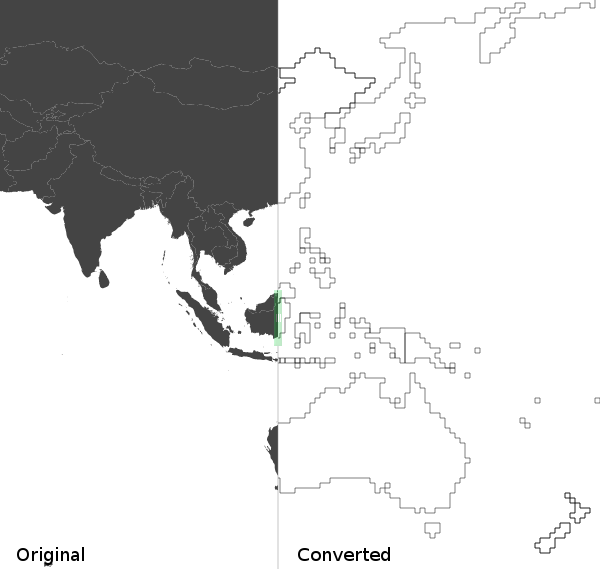

SVG paths to lines
==================

Turns paths to polylines in a svg document. Downsample / pixellize the lines in the process.

Gallery
=======

[Before/after demo](http://www.jollycyb.org/svg/) (pre rendered)
